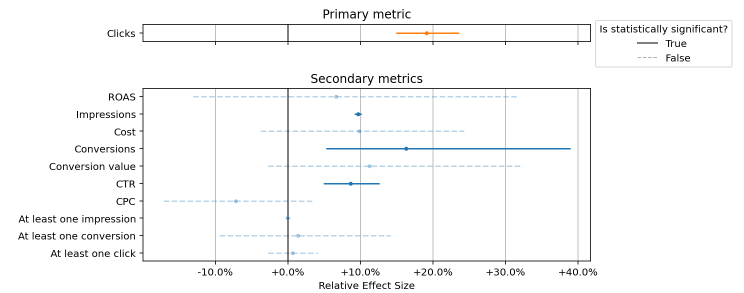
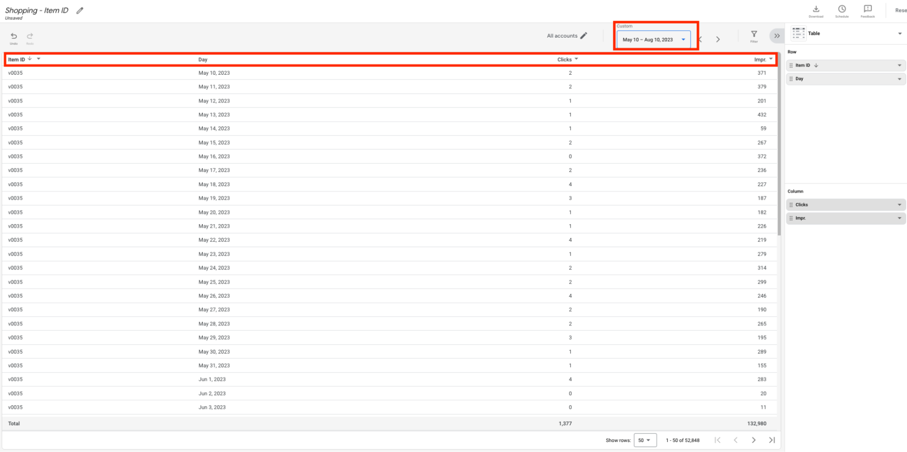

<br>

# FeedX: Transparent, robust and trustworthy A/B experimentation for Shopping feeds

[](https://www.python.org)
[](https://pypi.org/project/feedx/)
[](https://github.com/google-marketing-solutions/feedx/commits)
[](https://google.github.io/styleguide/pyguide.html)
[](https://colab.research.google.com/github/google-marketing-solutions/feedx/blob/main/notebooks/01_experiment_designer.ipynb)
[](https://colab.research.google.com/github/google-marketing-solutions/feedx/blob/main/notebooks/02_experiment_analyzer.ipynb)

**Disclaimer: This is not an official Google product.**

[Overview](#overview) •
[Getting started](#getting-started) •
[How it works](#how-does-feedx-work) •
[When to use FeedX](#when-to-use-feedx) •
[Step by step guide](#steps-for-running-a-feedx-experiment) •
[Input data](#input-data-for-feedx) •
[FAQs](#FAQs) 

## Overview

FeedX is an open source tool for running A/B experiments on Shopping feeds by randomizing feed items into control and treatment groups. It allows merchants and advertisers to reliably and efficiently test improvements to their product titles, descriptions, and other attributes of their feed items / products.

It uses industry best practices to ensure that the experiment is as robust and sensitive as possible, by implementing a crossover design [[1]](#1), adjusting for pre-experiment performance with CUPED [[2]](#2), and trimming outlier items if necessary [[3]](#3)[[4]](#4). These features are explained in detail in the section [How does FeedX work?](#how-does-feedx-work)

Having a high quality feed is crucial for high performing Shopping ads. If items have unclear titles or descriptions, are missing key attributes or have low quality images, then it’s less likely that users will click on those items, hurting performance. However, improving Shopping feeds can be challenging without a reliable feedback signal indicating whether the changes an advertiser makes are better or worse than what was there before. FeedX solves this problem by allowing advertisers to test these changes using reliable and trustworthy A/B tests. 

FeedX consists of a Python package, containing all of the logic and mechanics, and a set of Colab notebooks which demonstrate how to use the package to design and analyze experiments.  

FeedX is the recommended testing methodology for [FeedGen](https://github.com/google-marketing-solutions/feedgen). You can see a successful example of FeedX and FeedGen in the Think With Google article [Generative AI: Home24 improves the reach and performance of shopping ads with FeedGen](https://www.thinkwithgoogle.com/intl/de-de/marketing-strategien/automatisierung/home24-feedgen-shopping-ads/), where we were able to measure a 29% increase in clicks and a 25% increase in impressions.

## Getting Started

### With Google Colab

The easiest way to get started with FeedX is with Google Colab. FeedX has two Colab notebooks:

* **01_experiment_designer.ipynb:** Containing all the logic for designing a new experiment. Open in [Colab](https://colab.research.google.com/github/google-marketing-solutions/feedx/blob/main/notebooks/01_experiment_designer.ipynb) or view in [Github](https://github.com/google-marketing-solutions/feedx/blob/main/notebooks/01_experiment_designer.ipynb).
* **02_experiment_analyzer.ipynb:** Containing all the logic for analyzing an in progress or concluded experiment. Open in [Colab](https://colab.research.google.com/github/google-marketing-solutions/feedx/blob/main/notebooks/02_experiment_analyzer.ipynb) or view in [Github](https://github.com/google-marketing-solutions/feedx/blob/main/notebooks/02_experiment_analyzer.ipynb).

Just open the relevant notebook, save a copy into your Google Drive, and start from there.

### Without Google Colab

If you would prefer not to use Google Colab, then first install FeedX with:

```
pip install feedx
```

You can then import FeedX and use it for designing and analyzing experiments on your Shopping feed. For example, the following code will estimate the minimum detectable effect of an experiment design and validate with 1000 simulations that the results are reliable:

```python
import numpy as np

from feedx import data_preparation
from feedx import experiment_design
from feedx import experiment_simulations


rng = np.random.default_rng(1234) # Seed to make analysis reproducable

# Generate synthetic data for the example. Should be replaced with real data
# for an actual use-case.
raw_data = data_preparation.generate_synthetic_data(rng=rng)

# Format the data in preparation for the analysis, and perform data 
# validation checks.
historical_data = data_preparation.prepare_and_validate_historical_data(
    raw_data,
    item_id_column="item_id",
    date_column="date",
    primary_metric="clicks",
    primary_metric_column="clicks",
    rng=RNG
)

# Define the experiment design
design = experiment_design.ExperimentDesign(
  n_items_before_trimming=7000,
  runtime_weeks=8,
  pretest_weeks=4,
  is_crossover=True,
  crossover_washout_weeks=1,
  primary_metric="clicks",
  pre_trim_top_percentile=0.01,
  pre_trim_bottom_percentile=0.0,
  post_trim_percentile=0.0
)

# Run the simulation analysis to estimate and validate the minimum detectable effect
minimum_start_week = experiment_simulations.calculate_minimum_start_week_id(
  candidate_runtime_weeks=[8],
  candidate_pretest_weeks=[4],
  historical_week_ids=historical_data["week_id"].unique()
)
analysis = experiment_simulations.SimulationAnalysis(
  design=design,
  historical_data=historical_data.copy(),
  item_id_column="item_id",
  week_id_column="week_id",
  minimum_start_week_id=minimum_start_week,
  rng=rng
)
analysis.estimate_minimum_detectable_effect()
analysis.validate_design(n_simulations=1000)

# Print the results
if not analysis.all_robustness_checks_pass:
  print("WARNING: The results did not pass the validation checks.")

print(f"Relative minimum detectable effect on clicks = {analysis.relative_minimum_detectable_effect:.2%}")
```

More examples can be found in the two Colab notebooks.

## How does FeedX work?

### Summary

1. The advertiser starts with a new optimisation they would like to test, which would be applied to a large number of feed items, for example a title optimisation. This is called the “treatment”. Typically there should be at least 1000 items for the test to be reliable, but more is usually better. The FeedX design notebook will evaluate if there are sufficient items or if more are required.
1. The feed items are randomly split into two groups, a control group and a treatment group. 
1. The advertiser creates a [supplemental feed](https://support.google.com/merchants/answer/7439882?hl=en-GB&ref_topic=3163841&sjid=7770874677447797429-EU), containing only the optimisations for treatment items, and starts the experiment by uploading this supplemental feed to Merchant Center.
1. (Optional) If running a crossover experiment, half way through the experiment the advertiser swaps the groups, so the treatment group becomes the control group (meaning the optimizations are reverted back to the originals) and the control group becomes the treatment group (has the optimisations applied). This is done by changing the supplemental feed over. For more information on why this is done, see the next section on [crossover experiments](#crossover-experiments).
1. At the end of the experiment, the performance of all of the items are analyzed and compared between the control and treatment group. The impact on each of the metrics are reported, along with a confidence interval and the statistical significance. 

### Regular Experiments and the CUPED adjustment

In a regular, non-crossover experiment, the treatment is applied to the treatment group and not to the control group for the entire duration of the experiment. Then, once the experiment has concluded, we can compare the average performance of the items in the treatment group with the items in the control group, and if the items in the treatment group performed significantly better than those in the control group, we can conclude that the treatment was a success. 

However, it could be that just by chance, the items that were assigned to the treatment group on average perform better or worse than the control group, and this can make our experiment less sensitive. Therefore, when running a regular experiment, FeedX can apply a CUPED adjustment [[2]](#2). 

CUPED adjusts the performance of all of the items based on their performance before the start of the test, removing any bias introduced by the randomisation, and improving the sensitivity of the test. CUPED works similarly to a difference in difference analysis, where instead of analyzing the performance of each item during the runtime of the test, it analyzes the difference between the performance of the items in the experiment and the expected performance of the items based on their past performance. For more details, see the original paper [[2]](#2), or an introductory article [[5]](#5).

### Crossover Experiments

While the CUPED adjustment is very effective, it’s typically even more powerful to perform a crossover experiment (also known as switchback experiments) [[1]](#1). This is where the treatment and control groups are swapped half way through the test, and increases our chance of correctly finding the true impact of the treatment.

A crossover experiment controls for “within sample” variance, because we now observe every item both with and without the treatment, so it allows every item to be compared with itself. However, because  of this switching of the treatment, it’s necessary to exclude at least 1 week of data at the start of the experiment, and right after the crossover happens, to avoid leakage in the metrics from the treatment that had been applied before. These are called the washout periods. One week is typically sufficient for metrics like clicks or impressions, but depending on your business, if your primary metric is conversions and your average conversion window is longer than 1 week, you may need a longer washout period.

However, even though a crossover experiment requires us to throw away the data from these washout periods, it’s typically still a more reliable test than a regular experiment. The design notebook can be used to test both options and evaluate which one will work best for your use-case.

Note: crossover experiments are often confused with pre-post tests, where the treatment is turned on for all items in the feed, and then the average performance before vs after the change is analyzed. However, crossover experiments are fundamentally different, because they still exploit randomisation, so that 50% of the items are treated in the first half of the experiment, while the other 50% are treated in the second half. This averages out any seasonality, allowing for an unbiased estimate of the impact of the effect size (assuming the washout periods are set correctly), which is not possible with a pre-post test. 

These designs are compared below.


### Trimming Outlier or “Hero” Items

A challenge with experimenting with Shopping feed items is that their performance tends to be very skewed. This means that a small number of items, which we refer to as “hero” items drive the vast majority of the performance. Even with a CUPED or crossover experiment, these outlier items still represent a challenge for item randomized A/B tests, because typically the result of the test will depend entirely on these outlier items.

We therefore recommend trimming hero items. This can be done by either pre-trimming, post-trimming or a combination of both:

* **Pre-trimming** is where you remove the hero items from the experiment before it starts, based on their performance in the pre-test period. FeedX allows you to specify the percentage of items to remove from the top and/or bottom of your metric.
* **Post-trimming** is where you remove the hero items from the analysis after it has concluded, based on their performance during the experiment runtime. This is done by applying Yuen’s t-test for trimmed means [[3]](#3)[[4]](#4). FeedX allows you to specify the percentage of items to remove from both the top and bottom of your metric (for post-trimming the items must be trimmed from both sides equally).

The best thing to do is to select the smallest amount of trimming that will lead to a sensitive experiment (this can be explored by trying out different pre-trimming and post-trimming quantiles in the experiment runtime notebook). You want to avoid trimming too much so that you can test as many of your items as possible, to  make sure your results are representative of all of your items. 

## When to use FeedX

FeedX is designed to test changes that are made to many items in one go, for example when improving many titles at once. It cannot be used to test improvements to a single item, for example testing the impact of improving an individual item’s title. It also cannot be used to test campaign settings, such as the budget or tROAS of a campaign. 

**A useful rule of thumb is that your feed optimization should be affecting at least 1000 items for FeedX to work well**, however this is just a rough guide, and more items will always lead to a better test. The FeedX design notebook can be used to evaluate if the items you have selected are sufficient for a reliable test, or if you need more items.   

FeedX experiments should only be run on items that are actually impacted by the optimization. To give an example, if you are performing a title optimization that is only applicable to shoes (perhaps adding the shoe size to the title), then you should only include shoes in your test, and will need at least 1000 different shoe items for the test to work well. 

Also, while FeedX is an A/B test and therefore does not need to explicitly control for seasonality, it’s best to avoid running a FeedX experiment across “outlier dates”, where your primary metric spikes considerably higher than normal, for example black friday. Including such a date in your experiment will degrade the sensitivity of the experiment, making it difficult to reliably measure the impact of the experiment. 

It’s also important to be aware that FeedX can inflate the measured effect size due to spillover, so is typically appropriate for experiments where understanding the directionality is the main goal (is A better than B), but it is not critical to quantify how much better it is. This typically makes it appropriate for things like feed optimisations, but not for things like experimenting with pricing, where you really need to make sure the demand increases by enough to offset the change in price. See the [FAQ on spillover](#2-what-is-spillover) for more details.

## Steps for running a FeedX experiment

### 0. Before starting FeedX

Before beginning a FeedX experiment the advertiser must have already decided the following:

1. **What feed optimisation is being tested?** This is called the “treatment”. For example, the optimization being tested might be a range of improved titles. FeedX does not come up with the optimisation, it just tests it, so before starting FeedX this should already be in place.
1. **What is the primary decision making metric for the experiment?** You must choose a single main decision making metric. This is the metric that will be used primarily to evaluate whether the treatment was successful. We recommend clicks (see below), but you can select any performance metric, or explore a few different ones with the design notebook.
1. **How long would you be willing to run the test for?** Typically FeedX experiments can run for between 4 and 8 weeks, but if you have any constraints on that runtime you can provide that in the design notebook and FeedX will take it into consideration.
1. **Which items are eligible to be experimented with?** This should be all of the items that are eligible for your treatment, but should not include any items that your treatment would not change. For example, if your treatment is to add the brand name to the titles of your items, then you should not include any items that already have the brand name in the title, because these would be unchanged by your treatment. You should also not include any items which don’t have a brand that you would add to the title, as these would also not be changed. Note: it’s not necessary to run the test on all of these items if it’s a very large number, you can run the test on a random sample of them, or you can exclude the top or bottom performing items. But this can be experimented with in the design notebook.

#### We recommend clicks as a primary metric
Ideally, the primary metric of your experiment would be as close to the business value as possible, for example conversions or conversion value. However, these metrics typically have very high variance and are hard to measure reliably, meaning they will have a very large MDE. 

Therefore, we recommend using clicks as a primary metric. Improving your Shopping feed should have a strong impact on both the click through rate (CTR), because users prefer your new ads, and also on the number of impressions, because Google Ads will be more likely to surface higher quality items, which should combine to deliver more total clicks. By contrast, the impact on conversion rate (how like a click is to convert), or average conversion value, is likely to be limited - this will be more dependent on your site conversion rate and pricing. 

Therefore, clicks is a good compromise, and since items get far more clicks than conversions, it’s much easier to measure.

### 1. Experiment Design

#### Load Historical Data

The first step of a FeedX experiment is to design this experiment. This is done with the design notebook, which requires some daily or weekly historical performance data of all of the items eligible for your test, going back at least 8 weeks more than the longest runtime you would consider. For example, if you plan to run your test for 8 weeks, you want at least 16 weeks of historical data for those items for the design notebook. 

It’s recommended to choose a historical time period that is as recent as possible, however if that includes any extreme outlier dates, such as black friday, where your primary metric changes dramatically compared to the rest of the days, then choose a different time period to avoid that date.

This data should contain the following columns:

* Item ID: This is the identifier of the item
* Date: This is either the date for daily data, or the start of the week for weekly data.
* [Primary Metric]: This should be the value of your primary metric, for that item id on that date.

For example, if the primary metric were clicks and you were using daily data, the data might look like:

| Item ID | Date       | Clicks |
|---------|------------|--------|
| abc     | 2023-01-01 | 20     |
| def     | 2023-01-01 | 4      |
| abc     | 2023-01-02 | 25     |
| def     | 2023-01-02 | 7      |
| …       | …          | …      |

Note: If any rows are missing from your data, FeedX will assume that the primary metric was zero for the missing Item ID + date combinations. 

#### Perform power / sensitivity analysis

Then you can use the design notebook to perform a power analysis, which **simulates** how sensitive different experiment designs would have been in the past. FeedX quantifies the sensitivity with the minimum detectable effect and the relative minimum detectable effect, which is the smallest change in your primary metric that you would be able to measure reliably using that design, and should be as small as possible.

Typically the relative minimum detectable effect (MDE) is the easiest metric to interpret. As FeedX uses a two-tailed statistical test, a relative MDE of 5% means that if the primary metric changes by +/- 5% then it is likely it will be measurable in the experiment, however if it changes by less than 5% then it will not be possible to distinguish that change from random fluctuations, and so it will not lead to a statistically significant result. 

It’s important to think about how big an impact you expect your treatment to have, to know what a reasonable MDE would be. For example:

* If your feed is not well optimized, and these are your first big improvements, then you might expect a bigger impact, and so can accept a larger relative MDE.
* If your feed is already well optimized, and this is more of an incremental improvement, then you might expect a smaller impact, so you will require a smaller MDE.

The design notebook allows you to try lots of different experiment designs and compare their relative MDEs to see which is best. The design parameters you can tune are:

* **Runtime weeks:** The number of weeks to run the experiment for. Typically longer experiments will have a smaller MDE, but you will need to wait longer for your results.
* **Pretest weeks:** The number of weeks before the start of the experiment to use as pre-test data. This is used both for the CUPED adjustment, and to decide which items to trim for pre-test trimming. In both cases, the better the performance in the pre-test period is correlated with the performance in the runtime period, the better your experiment will be. Typically 2 to 4 weeks is reasonable.
* **Primary metric:** This is the main metric in your experiment. As mentioned above, we recommend using clicks, however you can experiment here with different metrics. If you are running experiments with a high performing feed that drives a lot of conversions, it might be possible to use conversions as a primary metric. On the other hand, if your feed is performing very poorly, perhaps it makes sense to start with experimenting on impressions at the beginning, as this is more sensitive. It can also be useful for very poorly performing feeds to target a metric like “the number of items with at least 1 impression per day” or “the number of items with at least 1 click per day”. These are extremely sensitive metrics, which will have the smallest MDEs, and are effective at measuring efforts to reduce “zombie items” that are never shown to users. However, it’s possible to improve these metrics while hurting overall clicks and impressions, so they are usually only appropriate primary metrics for poorly performing feeds. *Note: Here you are only selecting the primary metric, which is the main metric you care about. At the end of the experiment in the analysis step, you can still analyze every metric we have data for.*
* **Number of items before trimming:** This is the total number of items in your dataset. Ideally the more items you have, the smaller your MDE will be. 
* **Pre-trimming top percentile / pre-trimming bottom percentile:** The percentage of items to remove from the top or bottom of the dataset respectively, based on the value of the primary metric in the pre-test period. Trimming items can reduce the MDE if you have some outlier / hero items in your data, but it should be done with caution. The items you trim are not being tested, so if the feed optimisation works very badly for those items you won’t see it in your experiment. We typically recommend no more than 5%, and ideally much less.
* **Post-trimming percentile:** This is the same as the pre-trimming percentile, with the same trade-offs, but is based on the value of the primary metric in the experiment runtime, and it is symmetric - the items are trimmed equally from the top and bottom.
* **Is crossover:** If this is true, use a crossover design. If not, use a regular design. Crossover designs are recommended and typically have a smaller MDE, but both can be tested.
* **Crossover washout weeks:** The number of weeks of data to exclude from a crossover experiment after the start of the experiment and after the crossover happens. This should be at least 1 week for metrics like clicks or impressions, and for metrics with a longer lag (such a conversions) it could be increased.

#### Validate statistical assumptions are met

Once you have a design that has a good sensitivity (small enough MDE), it then needs to be validated. All of the statistical tests built into FeedX make the assumption that the central limit theorem (CLT) holds for the distribution of the metric, meaning that the sampling distribution of the mean is normally distributed. This usually holds for most distributions, with the exception of anything with a power law tail (as power laws have infinite variance, so the CLT does not converge).

We can validate this assumption with a simulation study. The simulations study runs 500 or more simulated experiments on the historical data, and checks that the results look as expected. If any of the checks fail, this means that the CLT assumption is not being met with your combination of experiment design and historical data. If this happens, you can try a few things:

1. **Use more items.** The CLT only applies when there are enough items in the test. There is no strict rule on what “enough” means in this context, but if the validation fails, increasing the number of items might fix it.
1. **Use a design with more trimming.** The CLT can fail if your data is extremely skewed (meaning you have a small number of outliers in your primary metric). This can be fixed by using either pre-test or post-test trimming. 
1. **Use a different metric.** If the above ideas don't work, you can try changing your metric. It could be that another metric will be better behaved.
1. **Validate some other designs.** If none of the above options have worked, you can validate lots of your designs with the simulation studies and see if some of them pass. Perhaps doing so will reveal a pattern, where certain design parameters are making the validation checks fail, and you can then use this information to select better parameters.  

#### Perform the treatment assignment

Finally, if the validation checks pass, the items receive a random treatment assignment, which is either 0 or 1. What this means depends on if you are running a traditional (non-crossover) experiment, or a crossover experiment:

##### Traditional (non-crossover) experiment treatment assignments

* **Treatment Assignment = 0:** The item is in the control group and so should not receive the treatment.
* **Treatment Assignment = 1:** The item is in the treatment group and so should receive the treatment.

##### Crossover experiment treatment assignments

* **Treatment Assignment = 0:** The item is in the "treat second" group, so should be treated in the second half of the experiment and not treated in the first half.
* **Treatment Assignment = 1:** The item is in the "treat first" group, so should be treated in the first half of the experiment and not treated in the second half.

#### Export the results

The treatment assignment and the selected experiment design are exported and should be kept somewhere safe, they will both be needed again for the next steps.

### 2. Experiment Runtime

Using the generated treatment assignment from the design step, create a [supplemental feed](https://support.google.com/merchants/answer/7439882?hl=en-GB&ref_topic=3163841&sjid=7770874677447797429-EU) for Shopping ads containing your feed optimisations only for the treatment items (see [Perform the treatment assignment](#perform-the-treatment-assignment) to understand which items to use). When you are ready to start your experiment, upload this to Google Ads. If you are running a crossover experiment, then half way through the experiment you must create a new supplemental feed with the feed optimisations for the control items instead of the treatment items, and swap to that supplemental feed half way through the experiment runtime. 

It is recommended to monitor the experiment throughout the experiment runtime, at least for the first few days after launching, and then at regular intervals. This can be done by running the analysis notebook with incomplete data. 

### 3. Experiment Analysis

Once the experiment runtime has concluded, you will need to extract either daily or weekly performance data for all the items that were part of the experiment (both the treatment and control groups). This will have the same format as the data for the design notebook, except instead of containing just your primary metric, it should contain all the metrics you would like to analyze. Typically these are clicks, impressions, cost, conversions, and conversion value. 

Note: the analysis can analyze ratios of these metrics, so for example you won’t need to extract the click through rate (CTR) per item, the analysis notebook will calculate that from impressions and clicks.

The data will need to cover the total runtime of the experiment, plus the pretest period that was part of the design. So if you had an 8 week runtime and a 4 week pre-test period, you will need to extract the last 12 weeks of data. 

You then feed this data, as well as the experiment design yaml file and the treatment assignment sheet from step 1, into the analysis notebook, which will perform the analysis. It will return the estimated impact and a confidence interval for the impact the treatment had on every metric. For an example of how the results might look, see below:



#### Interpreting confidence intervals and statistical significance

The statistical tests FeedX is using to calculate the confidence intervals and statistical significance all test the null hypothesis that the average of the metric is the same in the control and treatment groups. 

If you imagine splitting your items into two groups at random, but not actually changing anything for the treatment group (this is known as an A/A test), the averages of your metrics won’t be exactly identical in control and treatment groups. There is always some small amount of variation, which is due to random fluctuations and nothing to do with the treatment you are testing. 

FeedX calculates both p-values and confidence intervals for all of the effects it measures. P-values can be interpreted as how “surprising” your data would be under the null hypothesis, where a small p-value means a “surprising” result. Strictly speaking they measure the probability that an effect as large as the one you observed or larger would occur by chance in an A/A test. Industry best practices typically recommend concluding that your result is statistically significant if the p-value is less than 0.05, or there is less than a 5% chance that your data would have occurred in an A/A test. 

The confidence interval is a similar concept, which says that if you ran the same experiment many times, the confidence interval would contain the true effect 95% of the time. 

**If you observe a statistically significant positive impact on your primary metric,** meaning the p-value is smaller than 0.05 or the confidence interval doesn’t cover 0.0, then you can safely conclude that your treatment **caused** your primary metric to increase.

**If on the other hand the impact on the metric is not statistically significant,** then this means that a result as large as this one or larger could happen just by chance in an A/A test. This means that you cannot say with any confidence that the difference you have observed between control and treatment was actually caused by your treatment - it could be there by just random chance, so it is **not** safe to conclude that your treatment caused this impact. 

### End to End Example

**Designing the experiment**

1. You start designing a new experiment, and the longest runtime you want to consider is 8 weeks. Your primary metric is clicks, and you have 10,000 items that you can test with. 
1. You export 16 weeks of historical clicks data for those 10,000 items from Google Ads and import it into the design notebook.
1. In the design notebook you simulate lots of different designs using that historical data. You try all of the combinations of the following parameters:
    * Runtime weeks: 4, 6 or 8
    * Pretest weeks: 2 or 4
    * Experiment type: crossover or regular
    * Pre-trimming percentile: 0.0, 0.01
    * Post-trimming percentile: 0.0, 0.01
1. The design notebook estimates the MDE for every combination of parameters, and you find the following combination has a relative MDE of 5%, which is the lowest of all the designs you tested:
    * Runtime weeks: 8
    * Pretest weeks: 4
    * Experiment type: crossover
    * Pre-trimming percentile: 0.01
    * Post-trimming percentile: 0.0
1. You think 5% is a reasonable impact to expect from the optimization you are testing, so you select this design.
1. You run the validation step of the design notebook for that design, and it passes the validation checks.
1. Because the optimal design has a pre-trimming percentile of 0.01, and pre-test weeks is 4, the design notebook ranks all the items based on the total clicks they got in the last 4 weeks, and then removes the top 1% of items based on that.
1. The remaining items are randomized into control and treatment groups 50/50 and exported to a Google Sheet.
1. The design notebook exports that design as a yaml file, which you download for use in the analysis. 

**Running the experiment**

1. You use the exported treatment assignments to create a supplemental feed, containing the feed optimizations only for the treatment items, and on the date you want to start the experiment you upload this to Merchant Center.
1. Since you are running a crossover design, after 4 weeks (half of the runtime) you create a new supplemental feed containing only the feed optimizations for the control items, and replace the first supplemental feed with this one.
1. Once the experiment has reached the planned runtime, you proceed to the next stage.

**Analyzing the results**

1. Pull the data from Google Ads on all your metrics, including clicks (primary metric), impressions, cost, conversions and conversion value, per item per day or week, from 4 weeks before the start of the experiment to the end of the experiment.
1. Load the data and the experiment design yaml file into the analysis notebook.
1. This will use the data to analyze the impact of your optimization on all your key metrics, using the pretest data to perform a CUPED adjustment if necessary.  
1. Review the results and make a decision on whether to launch the optimization to all items if it was successful, or roll it back.

## Input data for FeedX

The input data required for both the FeedX design notebook and the FeedX analysis notebook can be extracted from Google Ads in several ways. Below are details outlining the sources and how to extract the required data:

Users can download item-level reports through the Google Ads interface by following these steps:

1. Reports > Predefined reports (Dimensions) > Shopping > Shopping - Item ID. 
  <br/>
1. The Item ID, Day or Week, Clicks, and Impressions must be selected. Other metrics are optional. Use the date picker to select the date range required for the experiment
  <br/>
1. Download the report in a format compatible with Google Sheets, for example .csv.
  <br/>

Alternatively, they can also download the item-level reports via:

1. The [Google Ads API](https://developers.google.com/google-ads/api/docs/get-started/introduction) is the programmatic interface to Google Ads, used for managing large or complex Google Ads accounts and campaigns. Users can create and submit a query to the API to get back data.
1. [Google Ads report transformation](https://cloud.google.com/bigquery/docs/google-ads-transformation) allows users to access tables and views of Ads reports with BigQuery. The [Shopping Performance view](https://developers.google.com/google-ads/api/fields/v15/shopping_performance_view) contains item-level metrics from Shopping campaigns.

## FAQs

### 1. Can FeedX be used outside of Shopping?

While FeedX is designed to optimize Shopping feeds, advanced users could use it for other use cases. Specifically, the cases where FeedX will work well are:

1. There are 1000s or more randomisation units, and they are fixed and can be measured over time. For example, for Shopping feeds the randomisation units are the feed items. These don’t change frequently and the performance metrics (e.g. clicks, impressions, conversions) can be measured per item per day. If your use-case has a different randomisation unit that fits the same criteria, it can be used with FeedX.
1. The treatment can be applied to each randomisation unit individually. The treatments in FeedX are all optimisations to Shopping feeds - title optimisations, description optimisations, etc. This means that it’s possible to apply the treatment to half of the items while not changing the other half. Any treatment where this is possible would work with FeedX.

### 2. What is spillover?

Spillover refers to the fact that a user will see items that are in both control and treatment, which may bias the results of the experiment.

**Because this solution randomizes items into control and treatment and not users, if the advertiser has items that can compete with each other, it is likely that the effect size measured in the experiment will be inflated.**

Typically this means that if the experiment measures a positive effect on a metric, then there really is a positive impact, but the true impact will be smaller in magnitude than what is measured in the experiment. 

This happens because FeedX randomizes items, and those items might cannibalize from each other. For example, if an advertiser improves the titles of 50% of their items, then those items will get more clicks. However, while some of those clicks will be incremental, some of them will be cannibalized from the other 50% of products that do not have the new titles. These cannibalized clicks will seem incremental in the test, but in reality once the change is rolled out to 100% of items that increase will go away. 

We don’t have a way to quantify the magnitude of this effect size inflation, but since it is just inflating the size of the effect, if the main goal of the test is to understand directionality (is A better than B?) then it shouldn’t matter. It’s just good to know that the measured effect size will be a bit bigger than the real one. Typically this rules out using FeedX in cases where the effect size matters, for example experimenting with price changes where the change in price needs to be offset by a large enough change in demand to ensure a positive impact on profit.

Spillover can be mitigated by performing cluster randomisation, where groups of similar items are randomized together [[1]](#1). This is something we are working on integrating into FeedX.

## Citing FeedX

To cite this repository:

```
@software{feedx_github,
  author = {Sam Bailey and Amanda Rodriguez},
  title = {FeedX: Transparent, robust and trustworthy A/B experimentation for Shopping feeds},
  url = {https://github.com/google-marketing-solutions/feedx},
  version = {0.0.1},
  year = {2024},
}
```

## References

<a id="1">[1]</a> 
[Cooprider J. and Nassiri S.
"Science of price experimentation at Amazon".
AEA 2023, NABE 2023.](https://www.amazon.science/publications/science-of-price-experimentation-at-amazon)

<a id="2">[2]</a> 
[Deng A. et al. 
"Improving the Sensitivity of Online Controlled Experiments by Utilizing Pre-Experiment Data".
WSDM 2013](https://www.exp-platform.com/Documents/2013-02-CUPED-ImprovingSensitivityOfControlledExperiments.pdf)

<a id="3">[3]</a> 
[Yuen, Karen K., and W. J. Dixon. 
“The Approximate Behaviour and Performance of the Two-Sample Trimmed t.”
Biometrika, vol. 60, no. 2, 1973, pp. 369–74.](https://www.jstor.org/stable/2334550)

<a id="4">[4]</a> 
[Keselman, H. J., et al. 
“The New and Improved Two-Sample t Test.” 
Psychological Science, vol. 15, no. 1, 2004, pp. 47–51.](https://www.jstor.org/stable/40063824)

<a id="5">[5]</a> 
[Jackson S.
"How Booking.com increases the power of online experiments with CUPED".
Booking.ai 2018](https://booking.ai/how-booking-com-increases-the-power-of-online-experiments-with-cuped-995d186fff1d)